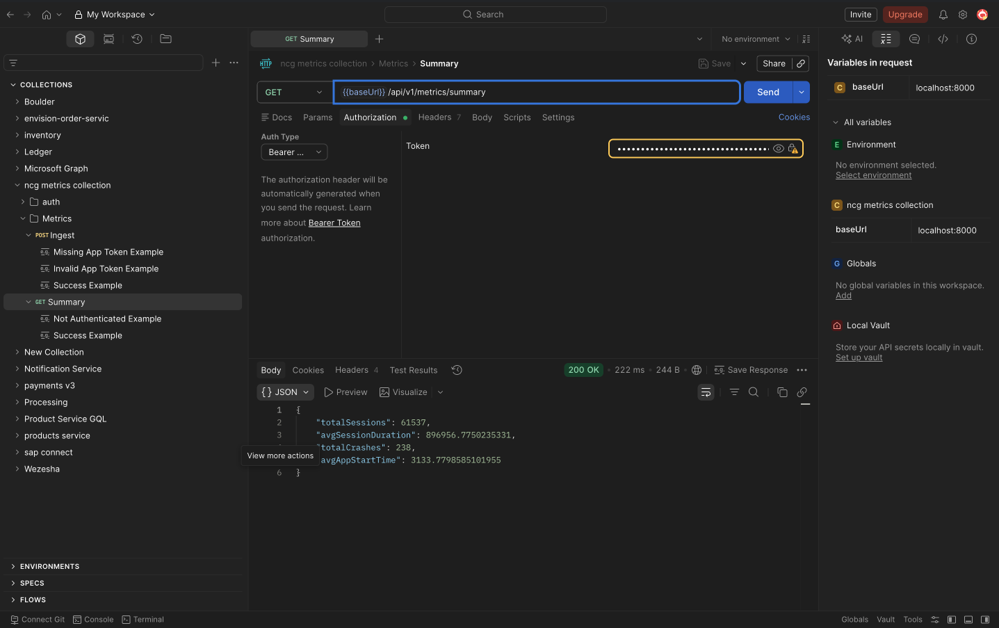

# NCG Metrics Platform

The NCG Metrics Platform is a collection of:

- An Android SDK for collecting application metrics
- A FastAPI backend for ingesting, storing, and querying metrics data

The goal of the project is to provide a lightweight observability and analytics platform for Android applications by capturing runtime metrics and sending them to a backend service for analysis.

---

# Project Overview

## Android SDK

The Android SDK is responsible for:
- Collecting application metrics
- Tracking application events
- Sending metrics data to the backend API
- Providing lightweight integration into Android applications

Examples of metrics may include:
- HTTP request metrics
- Screen performance metrics
- Crash metrics
- Frame drop metrics
- Application lifecycle events

---

## FastAPI Backend

The FastAPI backend is responsible for:
- Receiving metrics from the Android SDK
- Persisting metrics data
- Aggregating metrics
- Exposing APIs for querying metrics
- Providing analytics endpoints

---

# Project Structure

```text
.
├── api/
│   └── FastAPI backend application
│
├── sdk/
│   └── Android metrics SDK
│
├── ADR_001.md
│   └── Architecture Decision Record describing current trade-offs
│
├── docker-compose.yaml
│   └── Docker Compose setup for local development
│
├── ncg metrics collection.postman_collection.json
│   └── Postman collection with example API requests
│
└── README.md
```

# Running the Project

## Prerequisites

Ensure the following are installed:

- Docker
- Docker Compose

---

## Start the Project

Run the following command from the project root:

```bash
docker compose up --build
```

This will:

- Start PostgreSQL
- Create the `metrics_db` database
- Start the FastAPI backend
- Seed sample metrics data
- Create test users
- Expose the API locally

---

# Default Services

## PostgreSQL
- Database: `metrics_db`

## FastAPI Backend
The API will be available locally once the containers are running.

Example:

```text
http://localhost:8000
```

---

# Postman Collection

The repository includes a Postman collection containing example requests for interacting with the API.

File:

```text
ncg metrics collection.postman_collection.json
```

Import the collection into Postman to test:
- Authentication endpoints
- Metrics ingestion endpoint
- Metrics aggregation and analytics endpoints

### EXAMPLE OF API FETCHING SUMMARY OF 300,000 METRICS




---

# Architecture Decisions

See:

```text
ADR_001.md
```

For architectural trade-offs, limitations, and future improvement proposals.
